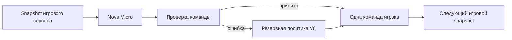

# ⚽ AgentF · V6 Direct Attack

Пять футбольных AI-агентов на Amazon Nova Micro: вратарь, защитник, полузащитник и два нападающих. Сохранённая версия проекта для возвращения к экспериментам после AWS Agentic Football Cup.

**Python · Amazon Bedrock · AgentCore · Offline tests · MIT**

## Как устроено

Игровой сервер циклично отправляет snapshot каждому агенту. Агент получает `gameState`, `teamId` и `myPlayers`, запрашивает Nova Micro и возвращает одну команду в JSON-массиве. Проверка владения и тактических ограничений отклоняет неподходящий ответ; резервная Python-политика обеспечивает команду при ошибке модели. Самостоятельного бесконечного цикла внутри агента нет: цикл организует вызывающий сервер.



## Тактика V6

| Ситуация | Решение |
|---|---|
| Мяч на своей половине | AERIAL-пас партнёру за центральной линией; без адресата — удар вперёд |
| Вратарь владеет мячом | Экспериментальный SHOOT CENTER с полной силой |
| Атакующий окружён | Пас открытому MID/FWD |
| Получатель в ударной позиции | Удар на первом snapshot владения |
| Игрок застревает у угла | Возвратный пас или выход к центру |
| Усталость | Ограничения спринта и прессинга по stamina |

Радиусы ударов: DEF 20, MID 28, FWD 32 единицы. Пас и удар партнёра происходят на разных тиках. Поддержка дальнего удара GK и его эффективность зависят от игрового движка; успешный ответ рантайма сам по себе не подтверждает гол или принятие команды движком.

## Быстрый старт без AWS

Python 3.12 рекомендуется (минимум 3.10).

```sh
python -m venv .venv
# Windows: .venv\Scripts\activate
# Linux/macOS: source .venv/bin/activate
python -m pip install -r requirements.txt
python scripts/test_offline.py
python team/lib/benchmark_fast_path.py --iterations 2000 --warmup 100
```

Тесты подменяют модель и не вызывают платные AWS API. Benchmark измеряет только Python-политику: он не включает сеть, cold start и генерацию модели.

## Структура

```text
team/lib/            Общая политика, parser, fallback, offline tests
team/ai-*/src/       Пять entrypoint и системные prompts
scripts/            Проверки и подготовка CodeZip-исходников
config/             Пример конфигурации без данных аккаунта
PROVENANCE.md        Происхождение, изменения и ограничения архива
LICENSE             Исходная лицензия MIT
```

## Восстановление рантаймов

`python scripts/prepare_runtime.py` копирует общую библиотеку в пять новых каталогов `build/`. Это локальная подготовка; AWS deployment не выполняется. В каждом каталоге находится `src/main.py`, `lib/` и зависимости. Для локального HTTP-сервера: `python build/ai-gk/src/main.py`. Вызов игрового handler с реальными входными данными обращается к Bedrock и может оплачиваться.

Модель задаётся через `AGENTF_MODEL_ID` (по умолчанию `us.amazon.nova-micro-v1:0`), регион через `AWS_REGION` (по умолчанию `us-east-1`). Учётные данные предоставляйте стандартной AWS credential chain, например отдельным профилем SSO. Не храните ключи в репозитории. Пример параметров находится в `config/runtime.example.json`; это справочная схема, не автоматически читаемый файл.

Для нового облачного запуска используйте актуальный AgentCore CLI и новый уникальный project name. CodeZip требует Python 3.12 и OpenTelemetry-зависимости из role requirements. Предыдущие ARN и аккаунт намеренно не перенесены. Сначала проверьте прямые вызовы всех ролей, затем зарегистрируйте новые ARN в доступном игровом портале и выполните fitness. Наличие доступа к прежнему турниру не гарантируется.

## Состояние архива

Основа: финальный локальный V6 R5 от 29.08.2026. Экспорт подготовлен 08.09.2026 без AWS-вызовов. Ранее подтверждались пять READY рантаймов и успешные прямые вызовы; актуальное состояние облачных ресурсов не проверялось. V6 была поставлена в пять слотов портала; последний наблюдавшийся экран показывал подготовку матча, итог этого матча не зафиксирован.

Это версия эксперимента, а не доказанная оптимальная стратегия: model-first добавляет latency, а резервный код иногда заменяет модельный ответ. Подробности происхождения и изменений — в [PROVENANCE.md](PROVENANCE.md).
